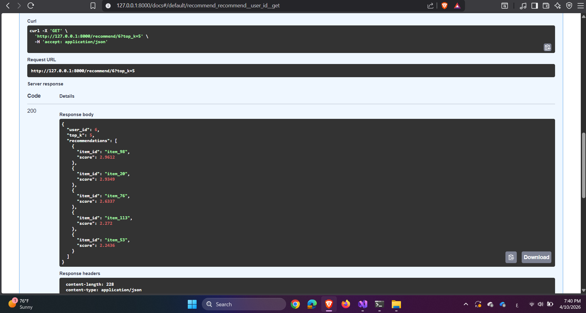

# RecoMatrix

A hybrid recommendation system that predicts user–item relevance using collaborative filtering and matrix factorization, deployed via FastAPI for real-time inference.

---

## Overview

RecoMatrix generates personalized recommendations by learning latent relationships between users and items using a hybrid recommendation approach.

---

## Approach

- Collaborative Filtering (user–item similarity)
- Matrix Factorization (latent features)
- Top-K Ranking Strategy

---

## Tech Stack

- Python
- Pandas / NumPy
- Scikit-learn
- FastAPI
- Uvicorn
- Swagger UI

---

## System Evaluation



---

## API Deployment

The model is deployed using **FastAPI**.

### Features:
- REST API for inference
- Swagger UI for testing
- JSON input/output format

### Run locally:
```bash
uvicorn app.main:app --reload
